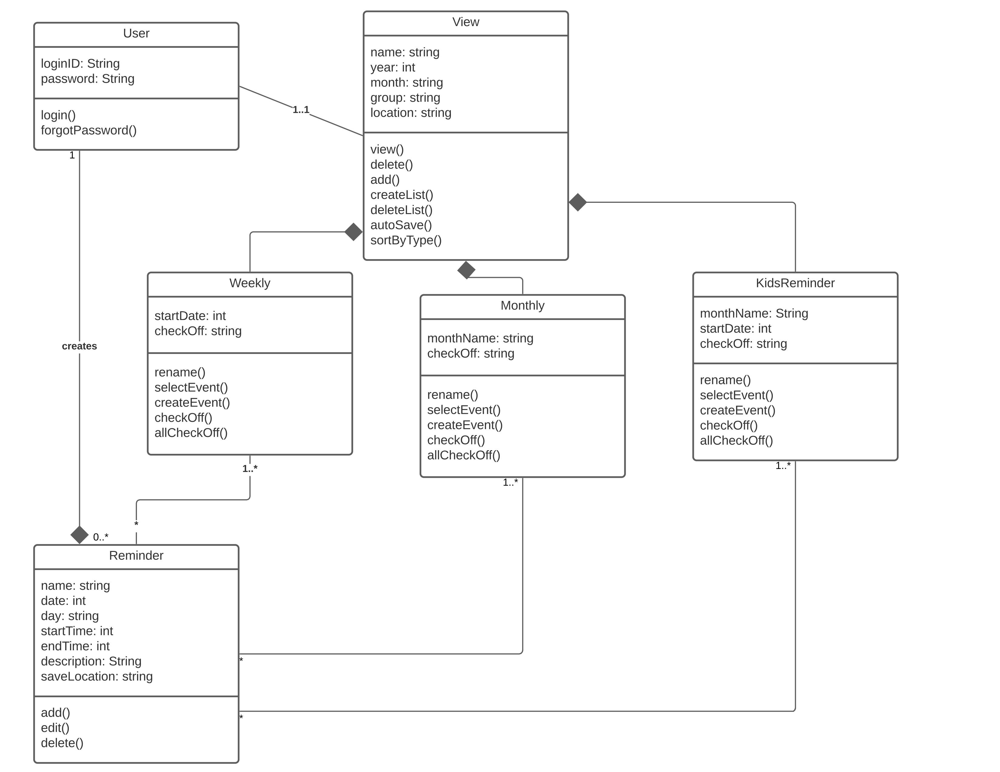
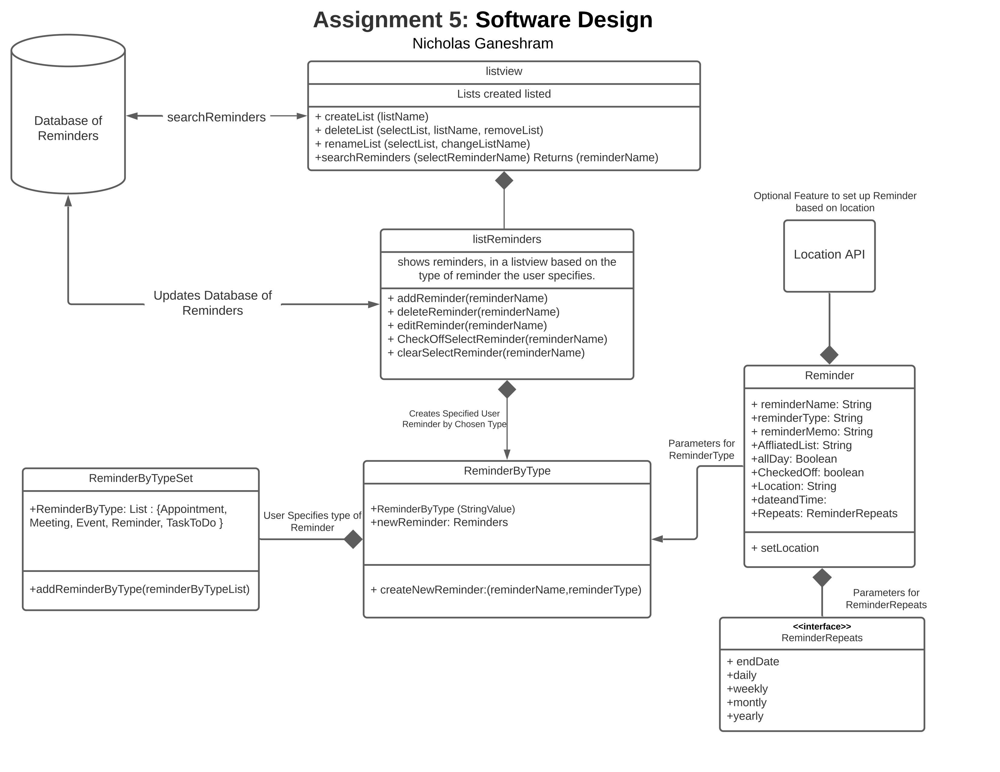
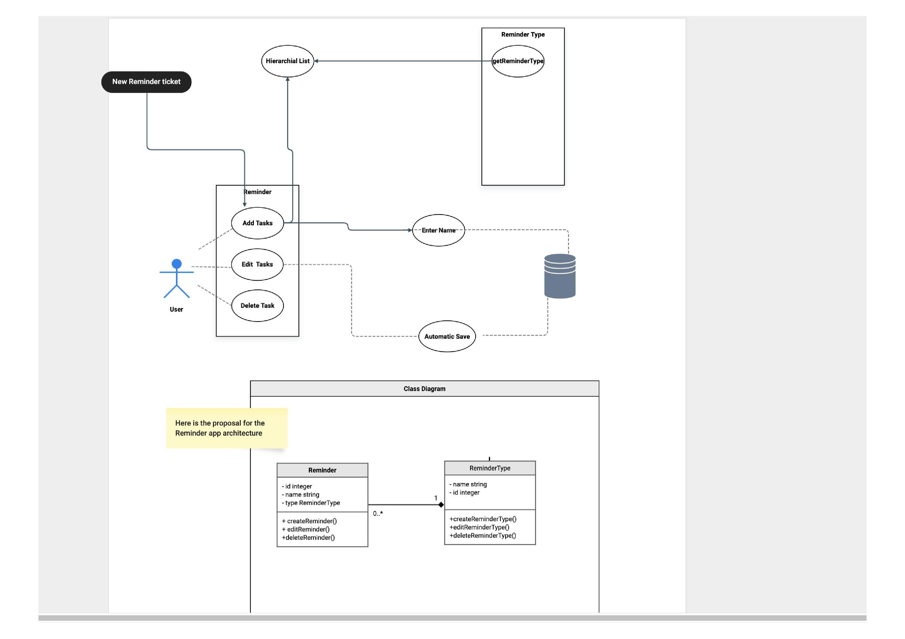
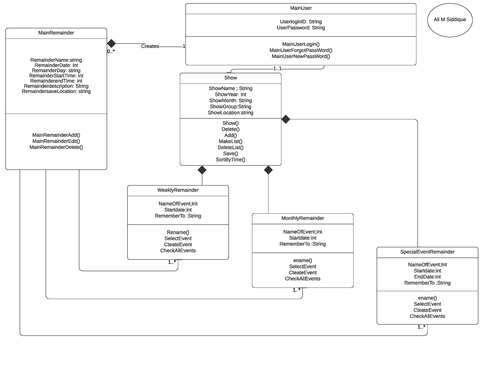
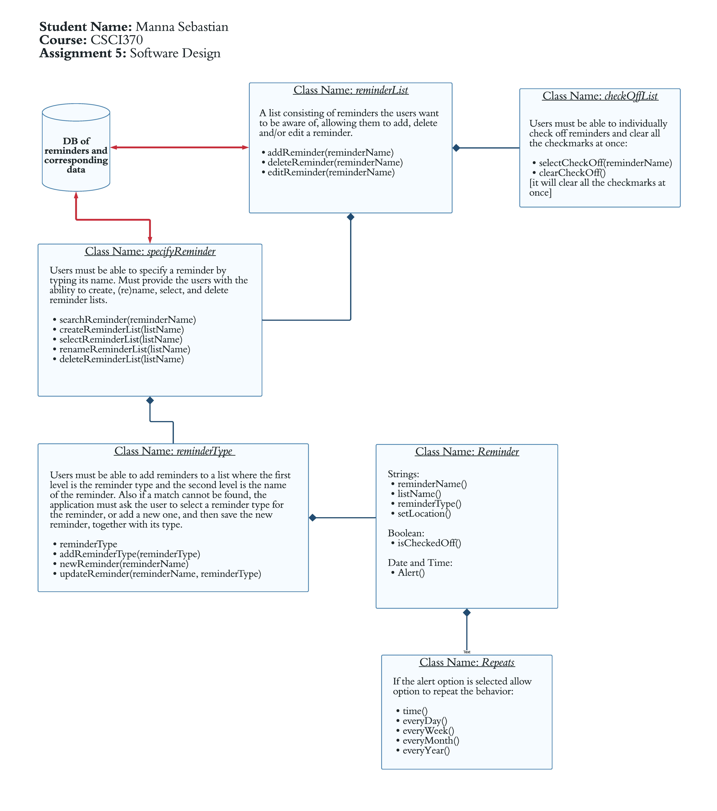
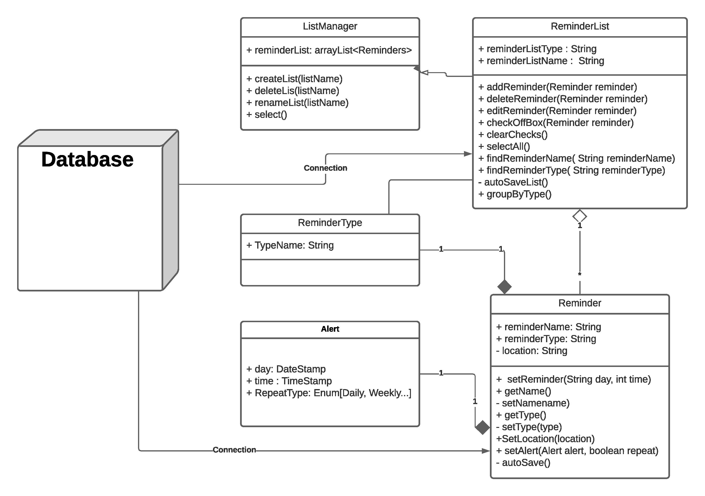
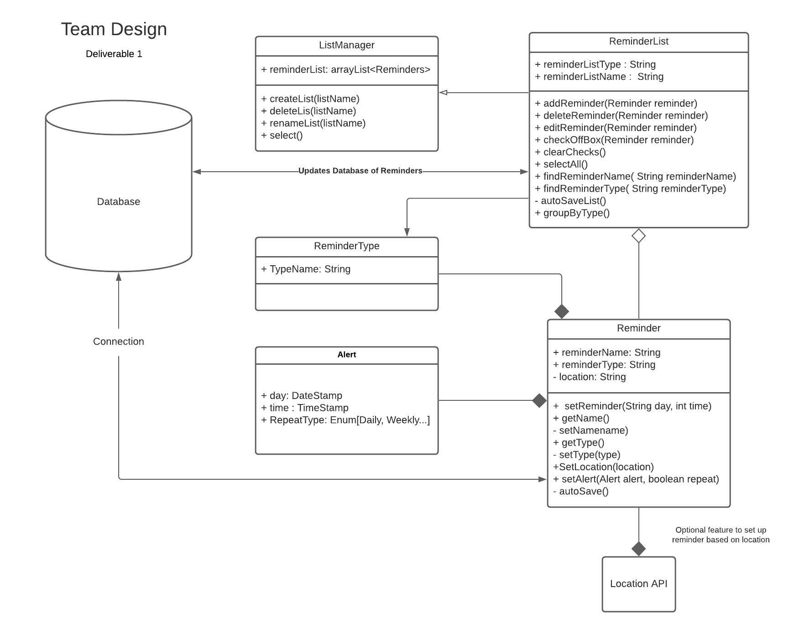

#### Rabina Aryal’s Design 1 

 
Pros:  
1. Clear and Concise, uses UML class Diagram Arrows, to show which classes are implemented and points to.
2. Implements different class names and follows the criteria, such as list of reminders, view, and Kid Reminder. 
3. The boxes are clearly labeled with the different layouts and class names.

Cons:  
1. Lacks a Database
2. Doesn’t have the Optional Location Data. 
3. Has a loginID and Password, while this may be useful for sync content between devices, might not be required in the app.  
 

#### Nicholas Ganeshram’s Design 2 

 
Pros:  
1. Uses object oriented concepts. 
2. Has clear boxes set up with class names, methods and parameters. 
3. Includes the necessary requirements with coherence. 
4. Accurate use of arrows to show which classes are connected and how. 
5. Includes the optional requirement for setting up the reminder based on location. 
6. Creatively incorporates a design to set up reminders with day and time alert as well as option to repeat

Cons: 
1. Not exactly a simple design 
2. Not entirely sure what the AffiliatedList string does
 
 
#### Hicham Merizak’s Design 3 

 
Pros: 
1. Clear class name with attributes and methods.
2. Relationship with multiplicity.

Cons:  
1.The top part of design is Use case diagram (UML class diagram is needed). 
2. Needs to update the lower diagram, adding all the design that is included in the top diagram.
 
#### Ali M Siddiques’s Design 4 

 
Pros: 
1. Good use of relationship connections
2. Comprehensive Design
3. Different types of reminders are separated into different classes thus Organized.

Cons: 
1. Show class should be renamed, a little unclear.
2. Needs a abstract class for the Main Reminder class
 
#### Manna Sebastian’s Design 5 

 
Pros:  
1. Schema follows separation of concerns
2. It follows Single-responsiblity Principle
3. It follows Interface Segregation Principle

Cons: 
1. The schema is highly normalized, if implemented using relational db will have many joins which might increase the latency.
 
#### Ishraq Khan’s Design 6 

 
Pros: 
1. Has a quick picture of the important entities in a system
2. The relationships between objects are simple enough
3. Multiplicity has been marked accordingly
4. Has an Alert class with objects

Cons: 
1. RemainderType has only one attribute.
 

#### Team Design  
 
 

Our team decided on updating one of our team members' designs to use as the main design for this project. While discussing we all came to the conclusion that Design 6 had the least amount of cons and was constructed quite nicely. There were however some things we added to make the design even better. We added some elements from each other's designs and implemented them into Design 6 to create our best UML. For example we added a box for location API and added additional notes along the arrows to make connections clear. The differences and similarities between team design and individual designs is based on the pros and cons of the individual designs. As we have picked the best design among our team members which has all the class, attributes and methods in the design.The design also includes the database to store data and location to use it to sort the group based on location. This is the reason why we picked this design and updated with location API. Our final design has all the necessary and straightforward information that will smoothly take this UML design to code.

 
 
#### Summary: 
	
Working on this group project together was an interesting experience. It goes without saying that group communication was a great necessity in working on this project. There wasn’t any complicated work to do but coming up with a unified agreement about all our UML designs proved to be a bit challenging with the virtualness of our situation. Nonetheless we figured out when to meet and how to go about working on this project, everyone was open to ideas and did their part well. Each of us chose one person’s 
design to critique, in Google Docs so everyone was able to see everyone's input and commentary. Overall, we critique each other's design and came up with an overall design that was best. From the lessons we learned how useful a UML design is, as generally we would just begin coding the project. Instead a UML design allows us to have a structure and idea before we start our task. 
