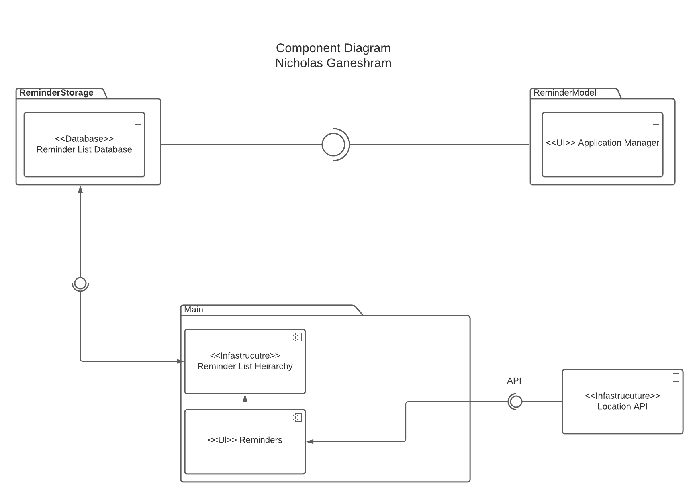

# Design Document

**Author**: Nicholas Ganeshram
 
## 1 Design Considerations
 
### 1.1 Assumptions
 
Design Considerations include choosing the correct database to use CRUD operations, as some databases are not structured hierarchically, which would cause a conflict when we display our reminders in our application. In addition we must consider different viewports for different sizes of phone screens, whether we also want our application to be used on tablets as well.  
 
### 1.2 Constraints
 
As mentioned above, our choice of database type is highly important as it will directly affect our methods of design. In addition, constraints to screen size, data use requirements, font sizes, and network issues are all considerations that we need to take into effect while designing our app. 
 
### 1.3 System Environment
 
Our minimum requirement for the app will be API Level 21 and above, and we use various phone screens in android studio to make sure our viewports scale correctly. 
 
## 2 Architectural Design

Our Architectural designs are shown below, we have implemented a component diagram and our deployment diagram to accurately show our database and application. 
 
### 2.1 Component Diagram

 
The following diagrams shows the design of our component diagram, the application manager will implement the database, which is labeled ReminderStorage. The database will be designed with Reminder List hierarchy so the user can have the reminders based on the specifications they desire. Depending on what database we choose, database hierarchy will have to be implemented accordingly. Meanwhile our Reminders will use a location api. 
 
### 2.2 Deployment Diagram

 
Our deployment diagram shows how our database will connect to our user's device,our database consists of the ReminderList, while our main device consists of the application manager and within that our reminder application. 
 
## 3 Low-Level Design
 
Our Low-Level designs below show our latest class diagram and other diagrams described accordingly. 
 
### 3.1 Class Diagram
 

 
### 3.2 Other Diagrams
 
## 4 User Interface Design

 
The above diagram shows our User Interface Design, with toggle locations and different views once the buttons are toggled. 
