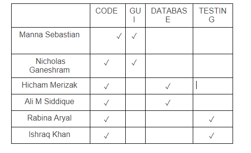

# Project Plan
 
**Author**: Nicholas Ganeshram and Manna Sebastian
 
## 1 Introduction
The overall goal of this project is to develop a Reminder Application where users can access and create reminders, with the ability to search, create, update and delete them as needed.   
 
## 2 Process Description
 
Activity #1

Launch the Application
The user will then login, or be prompted to make an account. Once completing these steps the user will then be directed to the home-page.
The Entrance criteria is dependent on the user being able to login or create their account. Valid Credentials are required.
The exit criteria for this activity is the User successfully logging in the application, and is presented with the home-page. The user can either logout, or close the application.

Activity #2

User has access to CRUD operations upon reaching the homescreen.
The user once presented with the home-page can Create, Read, Update existing reminders,or Delete them from their list. Users are greeted with a homepage, giving them the ability to create a reminder, upon clicking on the toggle button it will give them text-boxes specifying the name of the reminder, toggle switches based on the type of reminder, specifications for dates,location, whether they want this reminder to be repeated daily, weekly, monthly or once. Etc. Once the reminder is created, users are returned back to the homepage where they have the option to edit the reminder, delete the reminder or update the reminder to the status of being completed.   
The exit criteria is the user successfully completing their CRUD operations as needed. Once the user has completed their desired inputs they can exit the app, via closing it or logging out.        
 
## 3 Team
 
- Team members names: Manna Sebastian, Nicholas Ganeshram, Hicham Merizak, Ali M Siddique, Rabina Aryal, Ishraq Khan
- Roles: 
- GUI: the member(s) in charge of working on the GUI can use the visual design portion of Android Studio to showcase what the app would look like and showcase its visual practicality. 
- Testing: the member(s) in charge of the testing will come up with test cases, what inputs to provide and expected outcomes for cases that will cover the functionality of the app, whether they be automated or manual test cases.
- Code: the members in charge of the coding portion will be working on the meat of the project in which they have to program an Android app that implements a reminder list manager. They will use the team design to define classes, methods, objects, parameters, variables, etc. 
- Database: the member(s) in charge the database portion will work with database engines to   

