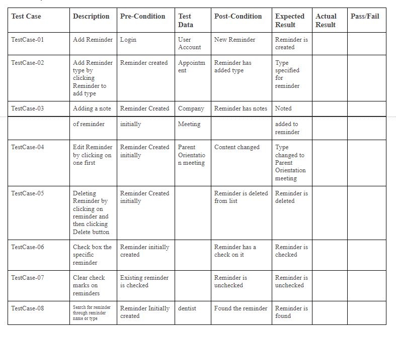

# Test Plan
 
**Author**: Ishraq Khan and Ali M Siddique
 
## 1 Testing Strategy
 
### 1.1 Overall strategy
 
Manual testing will mainly be done with technologies like JUnit. The reason for using this is because our application is a very simple system and it could be tested manually in an effective manner. The tests will be automated using gradle, the default build tool of Android Studio. If we code unit tests, we will manually test the class methods using JUnit. We would also perform black-box testing and white-box testing to catch and fix bugs.
Unit testing: Individual units or components of code should be tested. This will be performed to test the functionality of each component of every activity.
 
Integration testing: Exposes faults in the interaction between integrated units. Furthermore, we will do integration testing to ensure that the different activities are connected and so that there are no connectivity issues.
 
System testing: A complete and fully integrated app is tested to evaluate the end-to-end requirements.
Lastly, we will manually run regression tests using the Android Studio emulator. By doing this, it allowed us to test if our recent functions/code led to further errors and it also allowed us to look and fix the bugs.
 
 
### 1.2 Test Selection
 
First, black-box testing will be performed in order to ensure that the internal components are functioning correctly. We can run all the components and then test them one by one. In the final stages, system testing will be performed on each function. We will run system tests on the Android Studio emulator to test its overall functionality. This system testing is mainly the white-box testing.Regression testing was performed as we worked on our code. We had to ensure that the code of a component is not damaged by changes to other parts of our code.
 
 
### 1.3 Adequacy Criterion
 
Test cases should be documented thoroughly. They should not combine too many functional parts, making sure to isolate certain sections of the application, and then slowly building up complexity. Moreover, test cases should be executed and noted whether the result passed or failed. Thus, we would have to create a test cases table to document each procedure.
 
### 1.4 Bug Tracking
 
Unit testing: We would have to test each component individually. So when an error occurs, we would know which function to fix. Thus, as unit tests were performed, they were documented in the table below as either passed or failed. We could also look at the table to determine the functionality that needed to be fixed or modified.
 
### 1.5 Technology
 
Unit for manual testing.
Regression testing is performed every time we make changes to a component.
 
## 2 Test Cases

