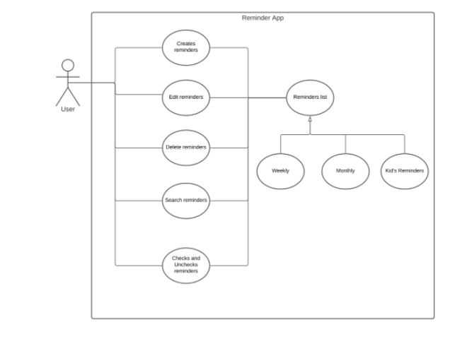
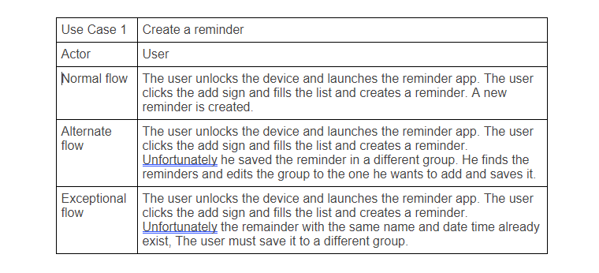
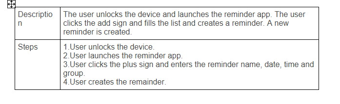
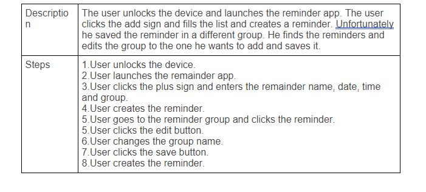
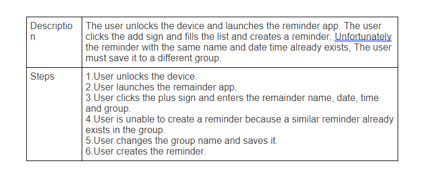

# Use Case Model
 
**Author**: Rabina Aryal and Hicham Merizak
 
## 1 Use Case Diagram
 

 
## 2 Use Case Descriptions
 
Requirements:  

	- The user can create reminders using their name, location, time and date. 

	- The user can edit the saved reminders. 

	- The user can sort the reminders based on category weekly, monthly and kid’s reminder and can also create a new group. 

	- The user can delete the reminders. 

	- The user can search for particular reminders. 

	- The user can check off the remainders once they are done with their task. 

  

Pre-conditions:  

	- The device should be on and the reminder app should be on the device screen.  

  
Post-conditions: Conditions that must be true once the use case is run.* 

	- The reminder is created and saved.  

	- The reminder is deleted. 

	- The reminder is displayed. 

  

Scenarios: 

 Reminder app use case: 

Normal Flow: 

Alternate Flow: 

Exceptional Flow: 

